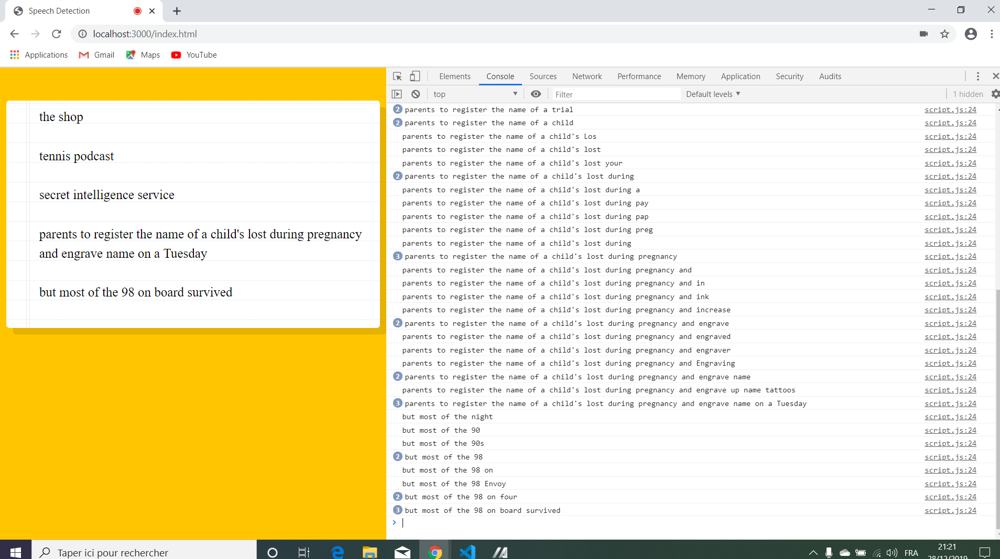

# Javascript Speach Recognition

Wes Bos Youtube Javascript30 tutorial: [JavaScript Speech Recognition #JavaScript30 20/30](https://www.youtube.com/watch?v=0mJC0A72Fnw&index=20&list=PLu8EoSxDXHP6CGK4YVJhL_VWetA865GOH).


*** Note: to open web links in a new window use: _ctrl+click on link_**

## Table of contents

* [General info](#general-info)
* [Screenshots](#screenshots)
* [Technologies](#technologies)
* [Setup](#setup)
* [Features](#features)
* [Status](#status)
* [Inspiration](#inspiration)
* [Contact](#contact)

## General info

* Tutorial Code for speach recognition using javascript, part of Javascript30 Youtube series by Wes Bos.

## Screenshots

.

## Technologies

* [Javascript v1.9 ECMA-262 ECMAScript 2018](http://www.ecma-international.org/publications/standards/Ecma-262.htm)

## Setup

* To install 'browser-sync' dependencies, type 'npm i'.

* To run app type 'npm start' then click on html file in browser.

## Code Examples

* speach recognition function to convert speach to paragraphs.

```javascript
  recognition.addEventListener('result', e => {
    const transcript = Array.from(e.results) // convert to array.
      .map(result => result[0])
      .map(result => result.transcript)
      .join(''); // join strings
  
      // create paragraph for each body of speach.
      p.textContent = transcript;
      if (e.results[0].isFinal) {
        p = document.createElement('p');
        words.appendChild(p);
      }
      if(transcript.includes('say the date' || 'the date')) {
        console.log(Date.now())   
      }

      if(transcript.includes('unicorn')) {
        console.log('🦄🦄🦄🦄🦄🦄🦄🦄🦄🦄🦄🦄🦄🦄🦄🦄🦄🦄')   
      }

      console.log(transcript);
  });
```

## Features

*  Add functions that can be triggered by certain words or phrases, such as 'get the weather'.

## Status & To-Do List

* Status: Working.

* To-Do: Could use for a special needs app.

## Inspiration

* Wes Bos Youtube Javascript30 tutorial: [JavaScript Speech Recognition #JavaScript30 20/30](https://www.youtube.com/watch?v=0mJC0A72Fnw&index=20&list=PLu8EoSxDXHP6CGK4YVJhL_VWetA865GOH)

## Contact

Repo created by [ABateman](https://www.andrewbateman.org) - feel free to contact me!
